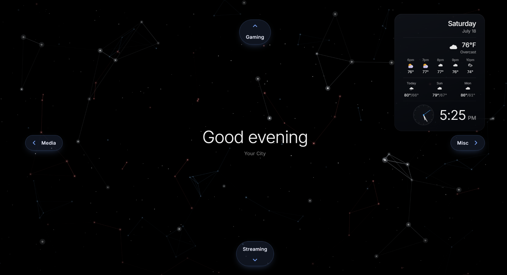
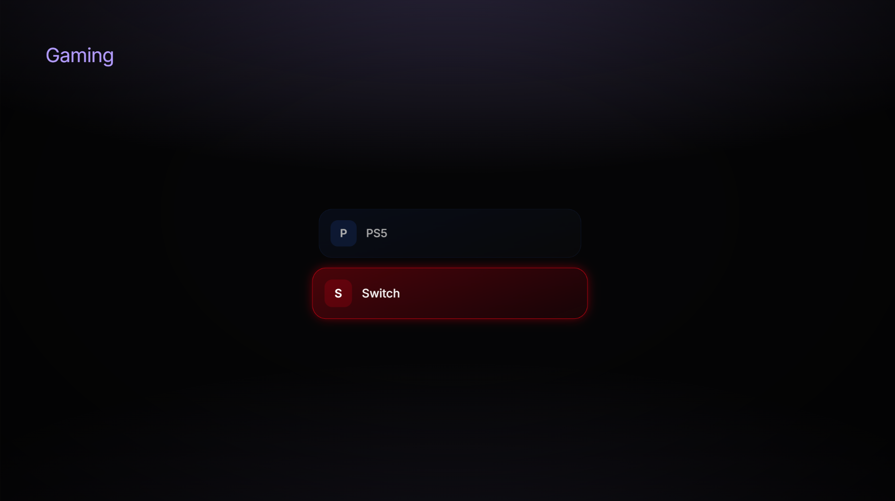
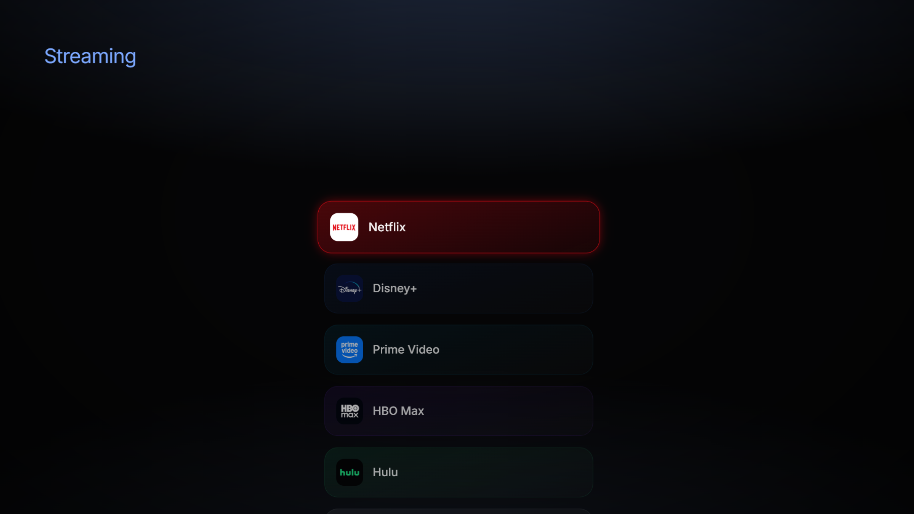
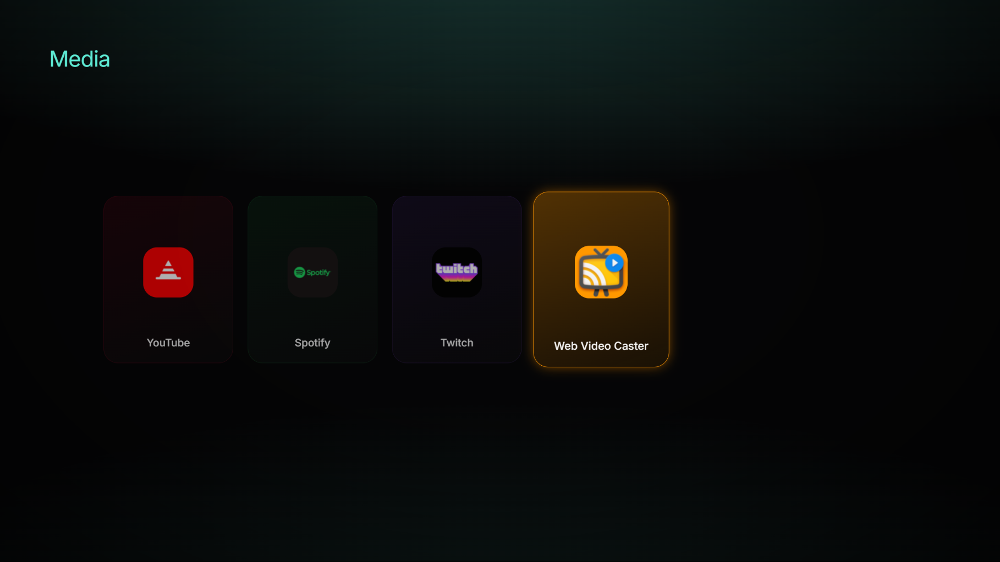
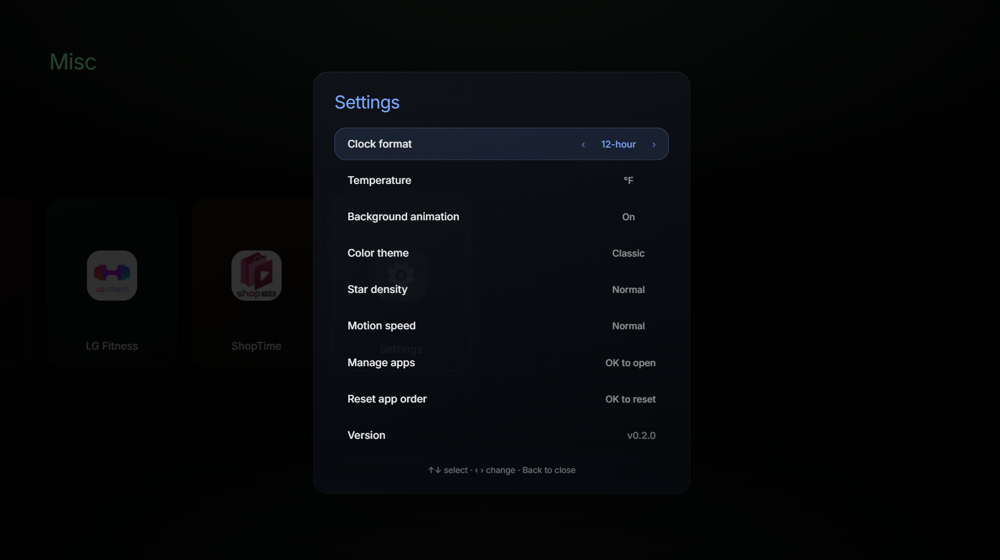
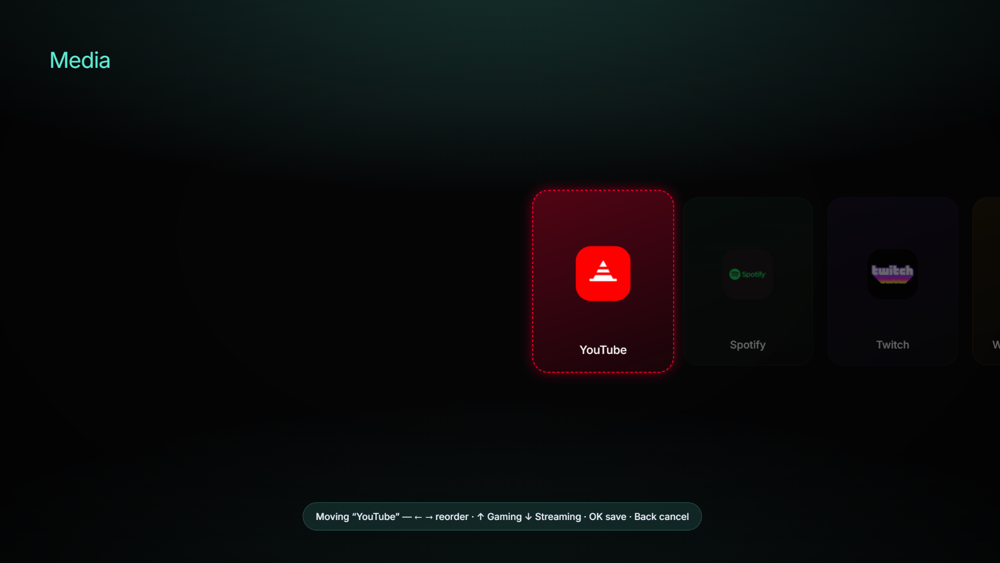

# Custom webOS Home

A replacement home screen for LG webOS TVs — no ads, no recommendation rows, no
carousel of things you'll never watch. Just your apps, a clock, and the weather,
on an OLED-friendly near-black background.

It runs as a sideloaded web app and (optionally) takes over the **Home button** and
**boot** so the TV comes up straight into it. Everything lives inside the app
package: it bind-mounts nothing, edits no OS files, and a plain uninstall reverts
the TV completely.



<p align="center">
  
  
</p>

> Built and proven on an **LG OLED, webOS 24 (Rockhopper 9.2.1), Chromium 108**.
> Other rooted webOS 9/10 models should work; the Home-button key code may differ
> (see [Troubleshooting](#troubleshooting)).

---

## What you get

- **Directional hub** — a center clock with four directions: **Up = Games**
  (HDMI inputs), **Down = Streaming**, **Left = Media**, **Right = Misc/Tools**.
- **Real launches** — tiles launch the TV's actually-installed apps and switch
  HDMI inputs via LunaService (`applicationManager/launch`).
- **Widgets** — analog + digital clock, date, and current temperature/conditions
  from [Open-Meteo](https://open-meteo.com/) (no API key). Set your city in
  **Settings → Location** (city search, saved on-device) — no rebuild needed.
- **Ambient mode** — after 60s idle it fades to a screensaver-style clock; the
  TV's own screensaver is vetoed so this replaces it.
- **eARC audio guard** — keeps audio on your configured output (e.g. an eARC/ARC
  receiver), which a bare app launch or a cold power-cycle can otherwise drop to
  the TV speakers. It *subscribes* to the live sound output and re-asserts the
  moment it drifts, and keeps retrying through the cold-boot window while the
  receiver's eARC link is still coming up. See
  [`src/service/luna.ts`](src/service/luna.ts).
- **Home button + autostart** — an in-package LunaService watches the remote's
  HOME key and relaunches the app; a webosbrew init.d hook boots into it. See
  [How the Home takeover works](#how-the-home-takeover-works).
- **Reorder & hide apps** in a built-in Settings overlay; layout persists.

## Screens

Navigate with the four directions on the remote; a short **OK** launches, a long
**OK** enters reorder mode.

| Up — Gaming (HDMI inputs) | Down — Streaming |
|:---:|:---:|
|  |  |
| **Left — Media** | **Right — Misc → Settings** |
|  |  |

Hold **OK** on any tile to reorder it (arrows move it, cross-axis presses send it
to another category):



## Tech stack

Vite + React + TypeScript + Tailwind v4 + Framer Motion, packaged with the
webOS `ares` CLI.

> **Critical build detail:** this TV is **Chromium 108**, below Tailwind v4's
> native baseline (Chrome 111, which needs `oklch()` and `color-mix()`).
> [`vite.config.ts`](vite.config.ts) runs **Lightning CSS** as the transformer
> targeting `chrome >= 108`, which downlevels `oklch()`→hex and
> `color-mix()`→`rgba()`. **Do not remove this** or colors break on the panel.

---

## Quick install (one-click)

Don't want to build anything? If your TV is already
[rooted](https://github.com/webosbrew/webos-homebrew-channel) with SSH enabled,
grab the launcher for your OS from the
[**latest release**](https://github.com/zzeppieri/webos-custom-home/releases/latest)
and run it — it asks for your TV's IP and does the rest --install + boot autostart
+ HOME-button takeover-- over SSH. No Node, no `ares` CLI, no building.

| Your computer | File | How to run |
|---|---|---|
| **Windows 10/11** | `install.bat` | Double-click |
| **macOS** | `install.command` | Double-click (right-click → Open the first time) |
| **Linux / WSL / Git Bash** | `install.command` | `bash install.command` |

Or, from any terminal, the same thing as a one-liner:

```bash
ssh root@<TV_IP> "curl -fsSL https://github.com/zzeppieri/webos-custom-home/releases/download/v0.4.1/tv-install.sh | sh"
```

See [`installer/`](installer/) for details and the uninstaller. Prefer the
classic `ares` sideload? `ares-install --device tv <the .ipk from the release>`.

The prebuilt app starts on a placeholder location — **set your own city right in
the app** (Settings → Location → search), no rebuild needed. The default app
list is baked in; to change which apps appear, edit
[`src/lib/apps.ts`](src/lib/apps.ts) and build from source (below).

---

## Prerequisites

1. **A rooted / dev-mode LG webOS TV.** Root via the
   [Homebrew Channel](https://github.com/webosbrew/webos-homebrew-channel) is
   recommended (needed for boot autostart). Plain LG Developer Mode works for
   sideloading and running, but **not** for boot persistence — see
   [`docs/TUTORIAL.md`](docs/TUTORIAL.md).
2. **Node.js 18+** on your computer.
3. **The webOS CLI:** `npm i -g @webos-tools/cli` (provides `ares-*`).
4. **An ares device profile** pointing at your TV — see below.

## Setup

```bash
git clone https://github.com/zzeppieri/webos-custom-home.git
cd webos-custom-home
npm install
```

### Point ares at your TV

Register your TV once (root SSH key or dev-mode passphrase):

```bash
ares-setup-device        # interactive: add a device named e.g. "tv" @ your TV's IP
ares-setup-device --list # confirm it's there
```

The deploy script assumes the profile is called **`tv`** and reads the TV's IP
for the post-install autostart step. Override either without editing code:

```bash
TV_DEVICE=mytv TV_IP=192.168.1.50 npm run deploy
```

### Configure what shows up

| What | Where |
|------|-------|
| App tiles, categories, brand colors | [`src/lib/apps.ts`](src/lib/apps.ts) |
| Weather location (lat/lon) | [`src/service/weather.ts`](src/service/weather.ts) |
| App icons (bundled `.png`) | [`public/icons/`](public/icons/) |
| HOME remote key code | `HOME_CODE` in [`service/service.js`](service/service.js) |

> App IDs must match apps **actually installed on your TV**. List them with
> `ares-launch --device tv --listApp`, or let the app merge your real launch
> points at runtime (it calls `listLaunchPoints` and adds unknown apps to Misc).

---

## Develop

```bash
npm run dev      # design in a desktop browser (luna calls no-op off-TV)
```

## Deploy to the TV

```bash
npm run deploy   # build → package → install → launch + re-arm Home watcher
```

`npm run deploy` ([`scripts/deploy.mjs`](scripts/deploy.mjs)) does the whole
loop. It packages the web app (`dist/`) **and** the service together with
`ares-package --no-minify` (ares' legacy minifier chokes on Vite's modern output;
Vite already minifies), installs, then runs the service's `autostart.sh` over SSH
— because `ares-install` kills the running service, and without re-arming it the
Home button stays dead until the next reboot.

Manual equivalent:

```bash
npm run build
ares-package dist service -o . --no-minify
ares-install --device tv tld.my.customhome_*.ipk
ares-launch  --device tv tld.my.customhome
```

---

## How the Home takeover works

Making a sideloaded app the *real* Home on webOS is normally impossible — Home is
a signed, read-only Flutter app. This project sidesteps that without touching any
OS files:

- **A registered in-package LunaService** ([`service/service.js`](service/service.js)).
  Registration is what grants it permission to call `applicationManager/launch`
  (a bare script can't). It:
  - `--boot`: on cold boot, launches the app, retrying until the app manager is
    ready.
  - `--watch`: does a **non-blocking poll** of every `/dev/input/event*` device
    and relaunches the app when it sees the HOME key (code `773` on this remote).
    (Non-blocking is essential — blocking reads across ~32 input nodes exhaust
    libuv's 4-thread pool and starve the device that actually carries HOME.)
  - A 1s heartbeat detects **wake-from-standby** (a big wall-clock gap) and
    relaunches, since init.d autostart only fires on cold boot.
- **A webosbrew init.d hook** ([`service/autostart.sh`](service/autostart.sh)),
  symlinked into `/var/lib/webosbrew/init.d/`, starts that service at boot.

Uninstalling the app (and removing the init.d symlink) restores stock behavior.
Nothing here is destructive.

## Troubleshooting

- **Home button does nothing / app doesn't relaunch** — your remote's HOME key
  code may differ from `773`. SSH in, run `cat /dev/input/event*` (or the
  project's capture approach), press HOME, and read the code; set `HOME_CODE` in
  [`service/service.js`](service/service.js).
- **Colors look washed out / wrong** — the Lightning CSS downlevel isn't running.
  Confirm [`vite.config.ts`](vite.config.ts) targets `chrome >= 108` and rebuild.
- **"Failed to minify code" when packaging** — you dropped `--no-minify`. Keep it.
- **Home dies after every deploy** — the install killed the service and it wasn't
  re-armed. `npm run deploy` handles this; if deploying manually, re-run
  `autostart.sh` on the TV afterward.
- **App won't launch a tile** — that app ID isn't installed on your TV. Check
  `ares-launch --device tv --listApp`.

## Credits

- The animated constellation background is a from-scratch Canvas-2D rewrite
  inspired by the *"Calm Space | Constellations | Minimalism"* Wallpaper Engine
  scene by **Volpots** (Steam Workshop item `3323607194`). No original assets are
  used — the look is reimplemented in code.
- Weather data from [Open-Meteo](https://open-meteo.com/).
- Built on the [webOS Homebrew](https://www.webosbrew.org/) project's tooling.

## License

[MIT](LICENSE). Bundled third-party app icons under `public/icons/` are the
property of their respective owners and are included only for interoperability;
replace them with your own if you prefer.
